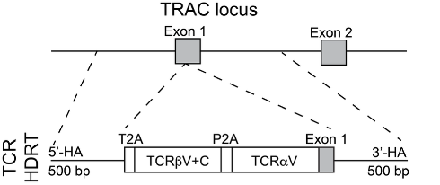
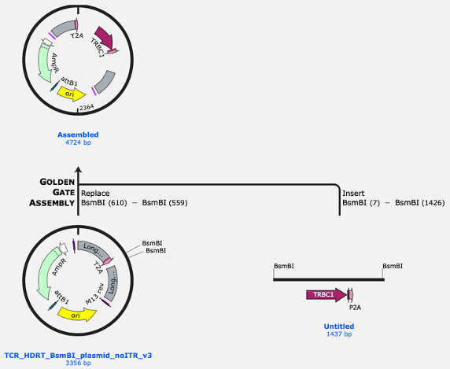

# Design TCR HDRTs

Tools for assembling T-cell receptor (TCR) sequences and designing HDR templates using STITCHR.

This repository provides scripts to process TCR sequence data and generate HDR template designs in a reproducible workflow.

Final TCR design generated by the pipeline:



# Quick Start

### Install Anaconda:

If Anaconda is not installed on your system, then install it using the link below.

https://repo.anaconda.com/archive/

If on Windows also install Git:

https://git-scm.com/install/windows

### Move to the location where you want the program to be:

Open the terminal and move to the location where you want the program to be.

(If on Windows use the PowerShell terminal)

Example on Mac:
```
cd /Users/[Your Username]/Desktop/ 
```

Example on Windows:
```
cd 'C:\Users\[Your Username]\OneDrive\Desktop'
```

### Clone the repository:

Then clone the repository using the following command: 

```
git clone https://github.com/SRHgroup/design_TCR_HDRTs.git
cd design_TCR_HDRTs
```

You have now generated a new folder called design_TCR_HDRTs, where the script and some example files are located.  

### Create and activate a conda environment:

```
conda create -n stitchr python=3.10 -y
conda activate stitchr
```

### Install STITCHR:

For more information about STITCHR - https://jamieheather.github.io/stitchr

```
pip install -r requirements.txt
```

### Download gene data for STITCHR:

```
stitchrdl -s human
```

### Test the installation:

#### Test STITCHR
```
stitchr -h
thimble -h
```

#### Test build_TCR_HDRTs.py 
```
python build_TCR_HDRTs.py -h 
```

# Example Usage

### To generate TCR HDR templates:

#### Run using D112K TRBC variant
For additional details on the D112K TRBC variant, see https://www.nature.com/articles/s41587-024-02531-6
```
conda activate stitchr
python build_TCR_HDRTs.py --use_D112K example/example_input.tsv -o example_results
```

#### Run using wildtype TRBC variant
```
conda activate stitchr
python build_TCR_HDRTs.py example/example_input.tsv -o example_results
```

### Inspect results

After running the example, open the example_results folder within design_TCR_HDRTs to view the generated output files. This folder contains the designed TCR HDRT sequences and supporting files in the following format:

```
example_results/
├── GenBank_files/
│   ├── BsmBI_Golden_Gate/
│   └── Clonal_Gene/
├── input.tsv
├── result.tsv
├── run.log
└── stitchr.tsv
```

- **`result.tsv`** – Final TCR HDRT sequences for cloning (main output)
  - **`complete_insert_no_BsmBI`** – Column with full clonal TCR gene construct
  - **`BsmBI_fragment`** – Column with full Golden Gate–compatible constructs
- **`GenBank_files/`** – Annotated .gb files for inspection in Benchling or SnapGene
  - **`Clonal_Gene/`** – Files for full clonal TCR gene constructs
  - **`BsmBI_Golden_Gate/`** – Files for Golden Gate–compatible constructs

- **`stitchr.tsv`** – Output file generated by STITCHR

- **`input.tsv`** – Copy of the original input file

- **`run.log`** – Execution log containing runtime messages, warnings, and errors (useful for debugging)

### Input Data

Input files should be provided as tab-separated tables containing TCR sequence information compatible with STITCHR formatting - https://jamieheather.github.io/stitchr.

An example input file is provided in: example/example_input.tsv

# Run using your own design

Open the `design_TCR_HDRTs` folder and either replace the TCRs in `example/example_input.tsv` with your own or create a new TSV file (e.g., `my_input.tsv`). You can choose any folder name for the -o parameter to store results. For example:

```
conda activate stitchr
python build_TCR_HDRTs.py my_input.tsv -o my_result
```

# Order constructs from Twist
1) Cloned plasmid (~185$/TCR)
2) Or gene fragment for Golden Gate assembly (~88$/fragment)

Plasmid design:




